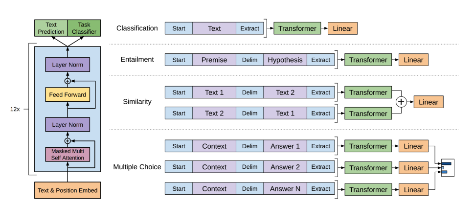

# 🤖 Transformer Modelleri Görevleri Nasıl Çözer?

## Genel Bakış

Transformer modelleri; metin (NLP), konuşma/ses, görüntü ve diğer modalitelerde çeşitli görevleri çözmek için kullanılır.  
Her görevdeki farklılıklar:
- Verinin nasıl hazırlandığı
- Hangi model mimarisinin kullanıldığı (encoder, decoder, encoder-decoder)
- Çıktının nasıl işlendiği


## 🧠 Transformer Mimarileri

### 🔹 Encoder  
Metni veya veriyi anlamaya odaklanır.  
**Örnek:** BERT — metin sınıflandırma, NER, soru-cevap

### 🔹 Decoder  
Yeni metin üretir.  
**Örnek:** GPT — metin tamamlama, yazı üretimi

### 🔹 Encoder-Decoder  
Bir veri türünü diğerine dönüştürür (çeviri, özetleme).  
**Örnek:** T5, BART — çeviri, özetleme, soru-cevap




## 🗣️ Transformer Tabanlı Dil Modelleri

Dil modelleri, kelimeler arasındaki ilişkileri istatistiksel olarak öğrenerek insan dilini anlar ve üretir.

### Masked Language Modeling (MLM) – Encoder tabanlı  
BERT gibi modeller kullanır. Maskelenmiş kelimeleri bağlamdan tahmin eder.

### Causal Language Modeling (CLM) – Decoder tabanlı  
GPT gibi modeller kullanır. Sadece önceki kelimelere bakarak bir sonraki kelimeyi tahmin eder.


## 🧩 Model Türleri ve Görevleri


**1. Encoder Modeller (BERT)**  
➡️ Metni analiz eder  
⚙️Kullanım alanları:  
- Sınıflandırma
- Named Entity Recognition (NER)
- Soru-cevap

**2. Decoder Modeller (GPT, LLaMA)**  
➡️ Yeni metin üretir  
⚙️Kullanım alanları:  
- Metin tamamlama
- Kod veya hikâye üretimi

**3. Encoder-Decoder Modeller (T5, BART)**  
➡️ Girdi → çıktı dönüştürür  
⚙️Kullanım alanları:  
- Özetleme
- Çeviri
- Soru-cevap


## ✍️ Metin Üretimi (GPT-2)

- GPT-2 causal attention kullanır.
- Pozisyon bilgisiyle birlikte embedding uygulanır.
- Maskeli attention geleceğe bakmayı engeller.
- Çıktı dil modeli başlığına verilir → sıradaki kelime tahmin edilir.


## 🗂️ Metin Sınıflandırma (BERT)

- WordPiece tokenizasyon
- [CLS] token’ı sınıflandırma için
- Segment embedding ile çift cümle ayrımı
- MLM + NSP ile pretraining yapılır
- Lineer katman ile sınıf tahmini yapılır


## 🔤 Token Sınıflandırma (NER / POS)

- Her token’a ayrı etiket verilir
- Final hidden state → lineer katman → token etiketi
- NER, POS tagging gibi görevlerde kullanılır


## ❓ Soru-Cevaplama

- Cevabın başlangıç ve bitiş pozisyonları tahmin edilir
- Span classification: start + end logits
- Cross-entropy loss ile eğitilir


## ✂️ Özetleme (BART)

- BART: encoder-decoder mimarisi
- Girdi bozulur → decoder düzeltir
- Text infilling: metin boşlukları [mask] ile doldurulur
- Decoder orijinali tahmin eder


## 🌍 Çeviri (BART / T5)

- Encoder, kaynak dili işler
- Decoder, hedef dili üretir
- mBART çok dilli destek sunar
- Cross-entropy loss ile eğitilir


## 🔊 Ses ve Konuşma: Whisper

- 680.000 saat ses verisiyle eğitildi
- Encoder: log-Mel spektrogram üretir → Transformer encoder
- Decoder: metin üretir
- Sıfır-shot tanıma ve çeviri yapabilir

```python
from transformers import pipeline

transcriber = pipeline(
    task="automatic-speech-recognition",
    model="openai/whisper-base.en"
)
transcriber("https://huggingface.co/datasets/Narsil/asr_dummy/resolve/main/mlk.flac")
```

## 🖼️ Görüntü İşleme: Vision Transformer (ViT)
- Görsel, küçük yamalara (patch) bölünür
- Her patch → vektöre dönüştürülür
- [CLS] token eklenir
- Pozisyon bilgisi ile birlikte Transformer encoder’a verilir
- Sadece [CLS] token çıktısı → sınıflandırma katmanına verilir
ViT ≈ BERT
- [CLS] token
- Pozisyon kodlama
- Encoder blokları

## 🔚 Sonuç
- NLP, görüntü, ses gibi farklı alanlarda Transformer mimarileri kullanılır
- Encoder → anlamaya yönelik görevler
- Decoder → üretim görevleri
- Encoder-decoder → dönüşüm görevleri (çeviri, özet)
- Transfer öğrenme sayesinde bu modeller pek çok göreve kolayca adapte olabilir.
